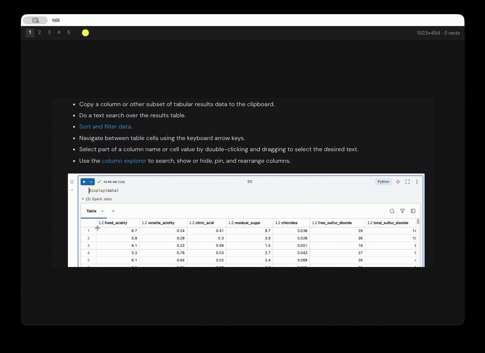

# hlit

A minimalistic Electron app for highlighting screenshots — draw rectangles
over the areas, and each rectangle applies an RGB color shift. Paste a
screenshot, highlight selections, copy or save the result.



## Platform support

Developed and tested on **macOS** only. Windows and Linux code paths exist —
the menu bar, the shortcut labels, and the config directory are all
per-platform — but have never been run on either system. Treat them as
untested.

## Run it

Requires Node.js.

```
npm install
npm start
```

To launch it from anywhere, alias the `--prefix` form in `~/.zshrc`:

```sh
alias hlit='npm --prefix ~/projects/tools/hlit start'
```

Detached launches and running the Electron binary directly are in
[docs/running.md](docs/running.md).

## Docs

- [docs/running.md](docs/running.md) — install, and every way to launch it.
- [docs/usage.md](docs/usage.md) — groups, profiles, selection, shortcuts,
  config files.
- [docs/themes.md](docs/themes.md) — palette file format, locking, forking.
- [docs/development.md](docs/development.md) — `npm run check` and the
  module map.
- [docs/releasing.md](docs/releasing.md) — the versioning policy and the
  tag-and-release procedure.

## License

MIT — see [LICENSE](LICENSE).
